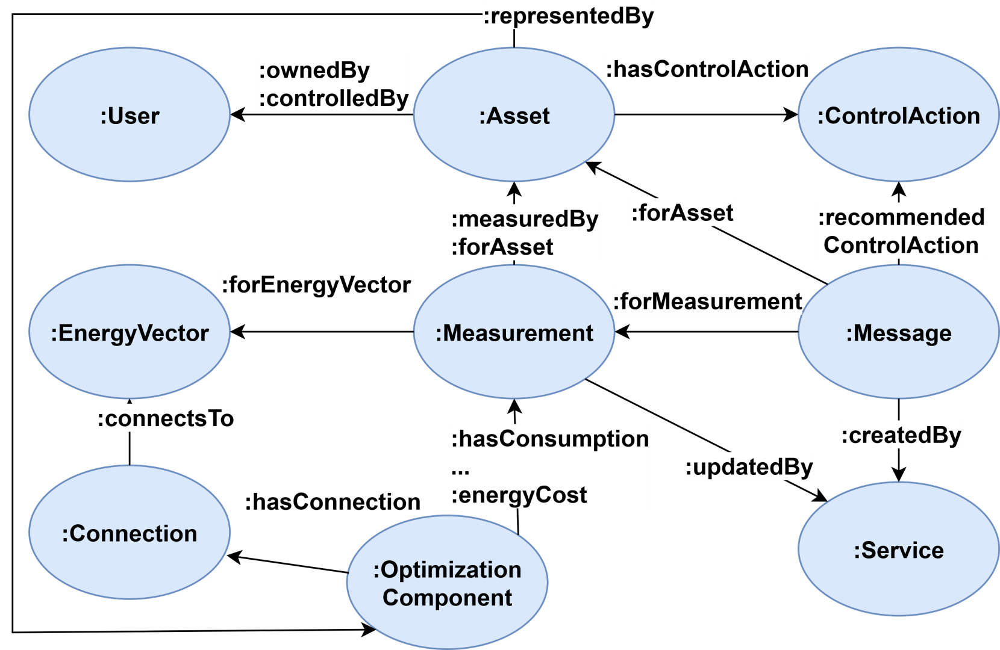

# LEConto - Local Energy Communities Ontology

The ontology contains the concepts relevant for energy management in local energy communities (LECs) to:
- Exchange information between different energy management systems;
- Develop portable software energy management services;
- Allow data sharing with other local energy communities and researchers.

## Ontology Description
The ontology covers the implementation-agnostic aspects related to the multi-vector energy management
in LECs. Where possible, the classes from other ontologies are used. For instance,
the representation of units of measurement and quantities
is not specific to LECs, so the concepts related to them are taken from the QUDT schema ontology.
The main classes included in the ontology are shown in the figure below:



### Assets and Control Actions
A fundamental element of any LEC is an asset - the abstract representation of a device, group of devices,
or any physical object, for instance, a building or a flat inside a building. The object property **:hasControlAction**
links an asset to the **:ControlAction** class. Control actions are commands that an asset accepts. 
For instance, users can increase or decrease the temperature set point of a thermostat. 

### Users and User Roles
Class **:User** represents users of the LEC software systems. Each user is assigned a role,
which dictates a set of rights and privileges in the system. User roles are modeled as a separate class **:UserRole**. 

### Software Service
Service is a representation of a software service within an energy management system.
The **:Service** can perform different functionalities, and as a result of the performed operations,
it can create measurements and messages. The class **:Measurement** has property **:updatedBy**
and class **:Message** has property **:createdBy** to identify which **:Service** created them.

### Measurements
Measurement is a representation of any numerical data received by the software from devices installed in a LEC
or software services. Measurement can be connected to multiple assets with property **:forAsset** to allow for
a fast search of measurements related to an asset.  Property **:measuredBy** connects **:Measurement** 
to at most one **:Asset** that performs this measurement. For example, a measurement representing a power consumption
related to an electric vehicle charging session is connected to two assets via property **:forAsset**: 
one asset representing charging equipment and another asset representing a vehicle.
The property **:measuredBy** in this case connects measurement only to the asset representing charging equipment,
because it is a device that collects data represented as **:Measurement**. If a measurement is calculated based on
other measurements by an energy management system, then property **:measuredBy** should not be used.
Measurements are also connected to the **:EnergyVector** class through the property **:forEnergyVector**. 
This enables measurement aggregations based on associated energy vectors. 
Each measurement should represent only one quantity expressed in one unit of measurement
(properties **:hasQuantityKind** and **:hasUnit**). For instance, temperature in kelvins, power in watts,
or energy in joules. If one asset can measure more than one quantity, 
each quantity should be represented as a separate measurement connected to the same asset. 

### Messages
Often, the software services (represented by **:Service** class) create not only numerical data
but also other forms of output. It can be recommendations for users to change the parameters of their devices
for performing demand response, identification of anomalies in system data, or recommendations on how to overcome them.
Such results are represented using **:Message** class. If the service generates the message related
to both **:Measurement** and **:Asset** classes, both of the subclasses should be inherited. For instance,
a service can be developed to establish residential demand response programs
by changing the cost of energy for consumers (modeled as **:Measurement**) or sending messages to the users 
directly asking them to change the parameters of their assets, for example, change the thermostat settings. 

### Energy Optimization
> [!NOTE]
> To simplify the connection between **:EnergyVector** and **:OptimizationComponent**,
> subproperties :**consumesFrom** and **:generatesTo** are introduced (with corresponding inverse properties),
> which removes the need to use **:Connection** class.

The energy optimization tools proposed for LECs create optimal energy profiles for optimization components. 
In the proposed ontology, the energy profiles are represented through individuals of **:Measurement}**
and **:MeasurementDataPoint** classes. However, the optimization components cannot be 
represented as assets - the components themselves may also not only describe a real physical device (e.g., sensor), 
but an aggregated virtual abstraction of a group of sensors
(for instance, the flexible electricity consumption of a building).
That is why a separate class **:OptimizationComponent** is proposed. 
Each type of optimization component is represented as a subclass of the **:OptimizationComponent** class. 
It is important to note that optimization components can be used by different optimization tools since they represent
the most common classes of devices in energy management systems.

---

## Changelog
### [1.0.0] - 2025-09-17
#### Added
- Initial publication of the ontology file based on the poster abstract accepted at the 14th DACH+ Conference on Energy Informatics.
- README, LICENCE, and CITATION files are added.

---

## Citation
The initial version of the ontology is described in [the poster abstract](https://energy.acm.org/eir/poster-abstract-knowledge-based-approach-for-multi-vector-energy-management-in-local-energy-communities/) presented at
[the 14th DACH+ Conference on Energy Informatics](https://energy-informatics2025.org/)
on September 18th, 2025, in Aachen, Germany.

```
@article{gagin2025b,
    author = {Gagin, Stepan and Goller, Elias and  de Meer, Hermann},
    title = {Poster Abstract: Knowledge-Based Approach for Multi-Vector Energy Management in Local Energy Communities},
    year = {2025},
    issue_date = {September 2025},
    publisher = {Association for Computing Machinery},
    address = {New York, NY, USA},
    volume = {5},
    number = {3},
    url = {https://energy.acm.org/eir/poster-abstract-knowledge-based-approach-for-multi-vector-energy-management-in-local-energy-communities/},
    journal = {SIGENERGY Energy Informatics Review},
    month = September,
    numpages = {3},
}
```
